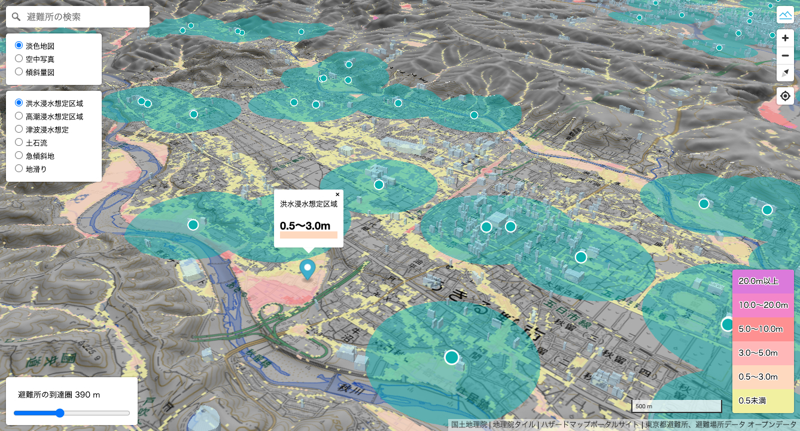

# sd-2024-5-sample

Software Design 2024 年 5 月号 「位置情報エンジニアリングのすすめ」第 10 回のサンプルコード

[DEMO ページ](https://satoshi7190.github.io/sd-2024-5-sample/)

リンク

-   [「位置情報エンジニアリングのすすめ」第 9 回 サンプルコード](https://github.com/satoshi7190/sd-2024-4-sample)
-   [「位置情報エンジニアリングのすすめ」第 8 回 サンプルコード](https://github.com/satoshi7190/sd-2024-3-sample)
-   [「位置情報エンジニアリングのすすめ」第 7 回 サンプルコード](https://github.com/satoshi7190/sd-2024-2-sample)
-   [「位置情報エンジニアリングのすすめ」第 6 回 サンプルコード](https://github.com/satoshi7190/sd-2024-1-sample)
